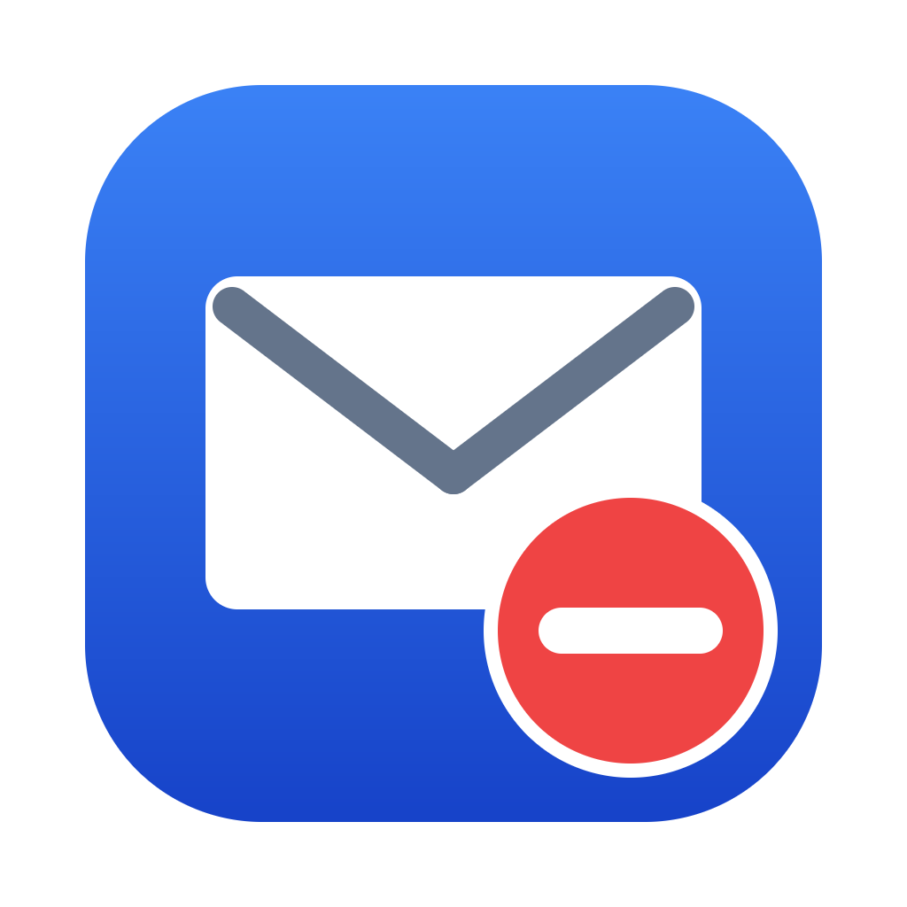

# Unsubscribe



Auto-unsubscribe from junk mail on your Mac. **Unsubscribe** reads the messages
sitting in your macOS **Mail.app** Junk / Spam mailboxes and unsubscribes from
them using the standard [`List-Unsubscribe`](https://www.rfc-editor.org/rfc/rfc8058)
email header that legitimate senders include.

Everything runs **locally on your machine**. No accounts, no passwords, no
servers. The only network requests it makes are to the unsubscribe URLs the
senders themselves put in their emails.

> **macOS · menu bar app · 100% local · MIT licensed**

## What it does

1. Asks Mail.app (via AppleScript) for the headers of every message in any
   mailbox named *Junk* or *Spam* — works for Apple Junk and Gmail Spam.
2. Parses the `List-Unsubscribe` / `List-Unsubscribe-Post` headers.
3. Unsubscribes:
   - **One-click** senders (RFC 8058) get a proper `POST`.
   - Others get a best-effort `GET` of the https link (some still want a click).
   - **Mailto-only** senders are logged and **skipped** — it never sends email
     from your account on your behalf.
4. **Flags** every junk message it acted on (a blue Mail flag) so you can see
   what was handled. Messages stay in Junk.
5. Records handled links in `seen.txt` so re-runs and the daily schedule skip
   work already done. Everything is logged to `log.txt`.

## Email provider support

Unsubscribe works **through Apple Mail**, so any account you've added to Mail.app
is covered — it scans each account's **Junk / Spam / Bulk** folder across *all*
accounts at once.

| Provider | Spam folder in Apple Mail | How it's covered |
|---|---|---|
| iCloud | ✅ Junk | Apple Mail scan |
| Outlook.com / Hotmail / Live | ✅ Junk | Apple Mail scan |
| Yahoo | ✅ Bulk | Apple Mail scan |
| AOL | ✅ Spam / Bulk | Apple Mail scan |
| Fastmail, Proton (via Bridge), most IMAP | ✅ Junk / Spam | Apple Mail scan |
| **Gmail** | ❌ — Gmail hides Spam over IMAP | **Gmail API** ([GMAIL_SETUP.md](GMAIL_SETUP.md)) |

**Gmail is the only major provider that needs the dedicated API path**, because
it's the only one that doesn't expose its Spam folder over IMAP. For everyone
else (AOL, Yahoo, Outlook.com, Hotmail, iCloud, …), just add the account to
Apple Mail and it's scanned automatically.

## Requirements

- macOS with **Mail.app** set up (your accounts already configured there).
- `python3` (preinstalled with Xcode Command Line Tools: `xcode-select --install`).

## Install as a Mac app

Build a real **Unsubscribe.app** and drop it in your Applications folder:

```sh
./build-app.command
```

This builds **Unsubscribe.app** — a **menu bar app** (an envelope icon in the
top bar, no Dock icon). If `swiftc` is present it compiles the native menu-bar
app from `Unsubscribe.swift`; otherwise it falls back to a simple run-once
launcher. The icon is generated with no dependencies (`generate_icon.py` →
`Unsubscribe.png` → `.icns`). It installs to `/Applications` (or
`~/Applications`) and is ad-hoc signed.

Click the menu bar icon for controls:

```
 ✉︎  Unsubscribe ▾
┌─────────────────────────────────────┐
│  Unsubscribe from Junk              │
├─────────────────────────────────────┤
│  Unsubscribe Now                ⌘U  │
│  Preview (Dry Run)…             ⌘D  │
│  Move No-Link Spam to Trash         │
├─────────────────────────────────────┤
│  Gmail: Unsubscribe from Spam   ⌘G  │
│  Gmail: Preview (Dry Run)…          │
├─────────────────────────────────────┤
│  Triage Inbox for Actions (AI)  ⌘T  │
│  Preview Triage (Dry Run)…          │
├─────────────────────────────────────┤
│  Last run: Unsubscribe              │
│  Open Log…                          │
│  Open Spammer List…                 │
├─────────────────────────────────────┤
│  ✓ Run Daily at 9:00 AM             │
│  ✓ Open at Login                    │
├─────────────────────────────────────┤
│  View on GitHub…                    │
│  Quit Unsubscribe               ⌘Q  │
└─────────────────────────────────────┘
```

<!-- Tip: replace the box above with a real screenshot — drop docs/menu.png in
     and use:   -->

- **Unsubscribe Now** — run for real
- **Preview (Dry Run)** — show what it would do, change nothing
- **Move No-Link Spam to Trash** — unsubscribe, *and* move junk that has no
  unsubscribe link to Trash (recoverable; asks first)
- **Gmail: Unsubscribe from Spam** — reach Gmail's Spam via the Gmail API (see
  [GMAIL_SETUP.md](GMAIL_SETUP.md))
- **Triage Inbox for Actions (AI)** — local-AI triage (see below)
- **Open Log** / **Open Spammer List** — view results
- **Run Daily at 9:00 AM** — toggle the background schedule
- **Open at Login** — keep it in the menu bar across reboots

It scans the Junk **and** Spam mailboxes of **every account** configured in
Mail.app. It never moves or deletes your mail — handled messages stay right
where they are in Junk, just marked with a blue flag.

### What it keeps

In `~/Library/Application Support/Unsubscribe/`:

- `seen.txt` — unsubscribe links already actioned (so re-runs skip them)
- `log.txt` — full run log
- `spammers.csv` — every junk sender it has seen (`address, name, example_subject`)

Prefer not to build an app? You can run it directly instead:

## Use it

**Try it safely first** — a dry run changes nothing and just shows what it would do:

```sh
python3 unsubscribe.py --dry-run
```

**Run it for real:**

```sh
python3 unsubscribe.py
```

Or double-click **`Unsubscribe.command`** in Finder.

> First run, macOS asks for permission to let the script control Mail. Click
> **OK** (this is the standard Automation prompt) and run it again.

## Gmail spam (Apple Mail can't see it)

Gmail does **not** sync its Spam folder over IMAP, so the Mail.app-based scan
can't reach it. `gmail_unsubscribe.py` talks to Google directly via the Gmail
API: it reads SPAM, unsubscribes via the `List-Unsubscribe` header, logs the
senders, and (with `--delete` or `"gmail_delete": true`) moves handled spam to
Trash. It uses **your own** Google OAuth client — a ~5-minute one-time setup in
[GMAIL_SETUP.md](GMAIL_SETUP.md). No third-party packages; credentials and
tokens stay in `~/Library/Application Support/Unsubscribe/`.

## AI triage (optional, 100% local)

If you have [Ollama](https://ollama.com) installed, Unsubscribe can also read
your recent **Inbox** and surface the messages that need your personal action
(reply, confirm, pay, sign, schedule, deadline). Your email is sent **only** to
Ollama on `localhost` — nothing leaves your Mac.

From the menu bar:

- **Triage Inbox for Actions (AI)** — classify recent inbox mail and mark the
  action items
- **Preview Triage (Dry Run)** — classify and report only, change nothing

Setup:

```sh
ollama pull llama3.1:latest    # or any model you prefer
```

It never deletes or archives anything, and it deliberately **errs toward
over-flagging** rather than missing a real action item. Configure it by copying
[`config.example.json`](config.example.json) to
`~/Library/Application Support/Unsubscribe/config.json`:

| key | default | meaning |
|-----|---------|---------|
| `triage_days`  | `3` | how many days back to read |
| `triage_mark`  | `"flag"` | `"flag"` = orange-flag in place; `"needs_action_mailbox"` = also **move** it into a local "Needs Action" mailbox |
| `triage_model` | `"llama3.1:latest"` | any installed Ollama model |
| `triage_max`   | `50` | safety cap on messages per run |

> Note: `needs_action_mailbox` moves matched mail into an **On My Mac** mailbox,
> so it leaves the server inbox (and your other devices). Use `"flag"` if you'd
> rather keep everything in place. Either way it's reversible.

## Run it automatically (optional)

Double-click **`install-schedule.command`** to have it run quietly once a day at
09:00 via `launchd`.

Disable later:

```sh
launchctl unload ~/Library/LaunchAgents/com.local.unsubscribe.plist
rm ~/Library/LaunchAgents/com.local.unsubscribe.plist
```

## Privacy

Unsubscribe is built to keep your data on your machine:

- **No telemetry, no servers, no account with us** — there's nothing to sign up
  for and nothing phones home.
- The **only** outbound requests are: the unsubscribe URLs that senders put in
  their own emails; (optional) your **local** Ollama for triage; and (optional)
  **your own** Google account via the Gmail API using **your own** OAuth client.
- All state (logs, the seen list, captured sender addresses, Gmail tokens) lives
  in `~/Library/Application Support/Unsubscribe/` and never leaves your Mac.
- The AI triage runs entirely on-device via Ollama — your email content is not
  sent to any cloud model.

## Notes & caveats

- Unsubscribe links in junk mail can themselves be tracking/confirmation pages.
  This tool only follows the official `List-Unsubscribe` header (not random body
  links), which is the safest signal available, but the web is the web — review
  the logs to see exactly what was contacted.
- By default it only **unsubscribes and flags**; it never deletes mail. Deletion
  (to Trash, recoverable) and the triage "move to a mailbox" behavior are both
  **opt-in** and clearly labeled.
- Distribution is **build-from-source** (`build-app.command`). The built app is
  ad-hoc signed, not Apple-notarized, so a prebuilt copy would trigger Gatekeeper
  warnings — building it yourself avoids that.

## Disclaimer

This software is provided "as is", without warranty of any kind (see
[LICENSE](LICENSE)). It automates actions on your real email — unsubscribing
from senders and, when you opt in, moving messages to Trash or other mailboxes.
**Use at your own risk.** Try **Preview (Dry Run)** first, review the logs, and
make sure you're comfortable with what it does before running it for real. The
authors are not responsible for any lost or mis-filed mail.

## Contributing

Issues and pull requests welcome. It's intentionally dependency-free (Python
standard library + Swift + AppleScript), so please keep new code in that spirit.

## License

[MIT](LICENSE) — © 2026 henrybasset
